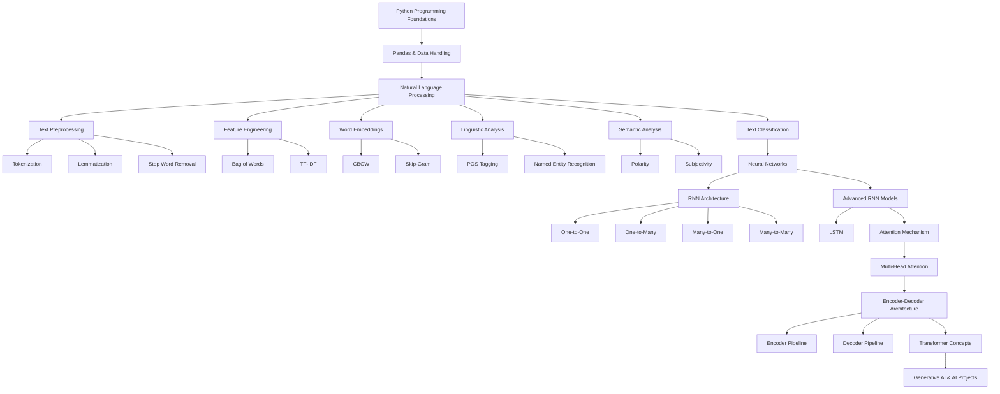

---

# README.md for `AI_ML_Learning` Folder

```md
# AI_ML_Learning

This folder contains notebooks and implementations related to Artificial Intelligence, Machine Learning, Natural Language Processing, Neural Networks, and Transformer-based learning concepts.

The notebooks are created as part of a structured learning journey aimed at understanding both theoretical concepts and practical implementations using Python.

---

# Folder Contents

## 1. Pandas.ipynb

Covers fundamental data handling and preprocessing concepts using Pandas.

### Topics Included
- Series
- DataFrames
- Data selection and filtering
- Data manipulation
- Important DataFrame operations
- Structured data handling

---

## 2. NLP.ipynb

Contains implementations and learning exercises related to Natural Language Processing.

### Topics Included

### Text Preprocessing
- Tokenization
- Lemmatization
- Stop Word Removal

### Feature Engineering
- Bag of Words (BoW)
- TF-IDF

### Word Embeddings
- CBOW
- Skip-Gram

### Language Understanding
- POS Tagging
- Named Entity Recognition (NER)

### Semantic Analysis
- Polarity
- Subjectivity

### NLP Applications
- Text Classification

---

## 3. Neural_networks.ipynb

Focuses on Neural Networks and sequence modeling architectures.

### Topics Included

### Recurrent Neural Networks (RNN)
- RNN Architecture
- RNN Flow
- Sequential learning

### Types of RNN
- One-to-One
- One-to-Many
- Many-to-One
- Many-to-Many

### Advanced Architectures
- LSTM
- LSTM Architecture
- Long-Term Dependency Handling

### Attention Mechanism
- Attention Flow
- Multi-Head Attention

---

## 4. Encoder_and_Decoder.ipynb

Explores Transformer-related learning concepts.

### Topics Included
- Encoder Pipeline
- Decoder Pipeline
- Encoder–Decoder Architecture
- Flow of Information
- Attention-based learning concepts

---

# Learning Objective

The purpose of this folder is to:
- Build strong AI/ML fundamentals
- Understand NLP and deep learning concepts
- Explore transformer-based architectures
- Prepare for real-world AI and Generative AI projects

---

# Tools & Technologies

- Python
- Google Colab
- Pandas
- NLP Techniques
- Deep Learning Concepts

---

# Learning Journey Flow



# Note

This repository is continuously updated as part of an ongoing AI/ML and Generative AI learning journey.
